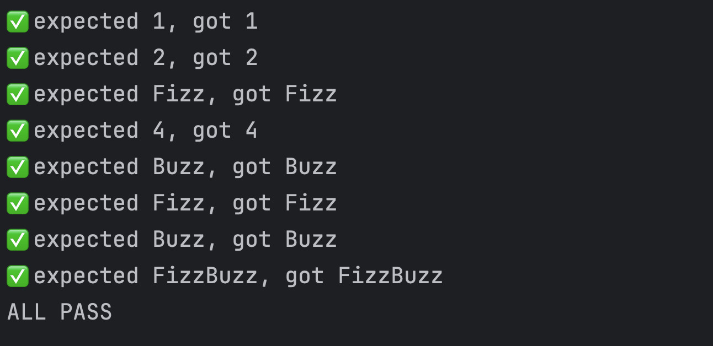
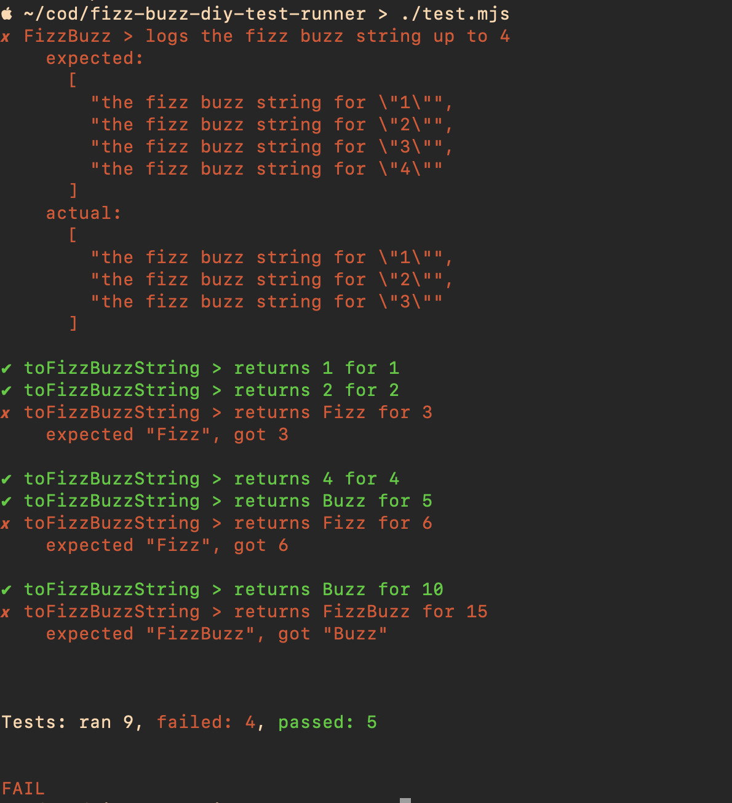

# How Do You Become An Expert (When You're On The Clock)

In software development, there is always something new to learn. One day you're an expert;
the next year you're a novice. Our success depends on how well we learn.

In this presentation and live coding demo, I'll be talking about alternatives to "fake
it 'till you make it". I'll share stories about challenging learning situations, and leave
you with some concrete ideas for how to make yourself an expert in the tools and practices
you use at work.

We will be creating a minimal (<100 loc) test framework from scratch to explore how toy
projects can de-mystify magical tools and translate jargon into intuition.

The talk is intended for software developers and those whose job requires them to
influence or lead software developers.

To get the most out of the talk, you will need to be able to read JavaScript code. Or, you
could plan on answering emails for the live coding part of the talk and just tune in for
the stories and conclusions.

## Dev Notes

### Prerequisites

- Node >= 22
- that's it -- there's no npm dependencies here

### Running

Run the solution with:

    node ./fizzBuzz.mjs

Run the unit tests with:

    node ./test.mjs

## Screenshots

