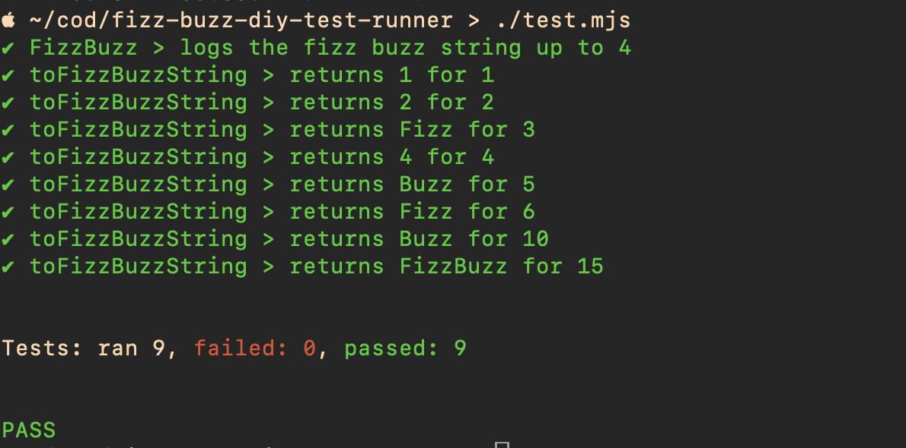

# How to TDD when your language has no testing framework?

We'll be solving FizzBuzz together, but we'll do it without any test tooling --
we'll build our own as we go. The first test we write will use no special
tooling. By the end, we will have written about 100 lines of hand-written
test tooling code in JavaScript which we use to write Jest/Jasmine style
`describe`/`it`/`expect` tests. 

For those who test or want to, this is a discussion of the essence of unit
testing with advice for improving your testing game.

For those who teach or coach, this is a discussion of how we can use first
principles to de-mystify "magical black box" tools.

## Intro Question

### For coders

Which of the following statements best fits your current approach to dev
tooling?

1. Somebody else sets up the development environment and chooses the tools. I
   write code in the provided environment.
2. I choose or build the tools I need to do my job. When they don't suit my
   needs, I change them.

I hope after today, you will be more comfortable operating in the second mode.

### For coaches/teachers

What techniques do you use to de-mystify tools or techniques that your pupils
treat as a "magical black box". When folks are looking for cheat sheets but you
want to give them a rich mental model instead, how do you do it?

Today I will be showing a teaching technique I use that starts with "if we
didn't have tool X or other off the shelf alternatives, what would we do?". You
may find it helpful, or you may have advice for me for other ways I can transfer
my mental model about a tool to pupils.

## Dev Notes

### Prerequisites

- Node >= 22
- that's it -- there's no npm dependencies here

### Running

Run the solution with:

    node ./main.mjs

Run the unit tests with:

    ./test.mjs

## Screenshots

