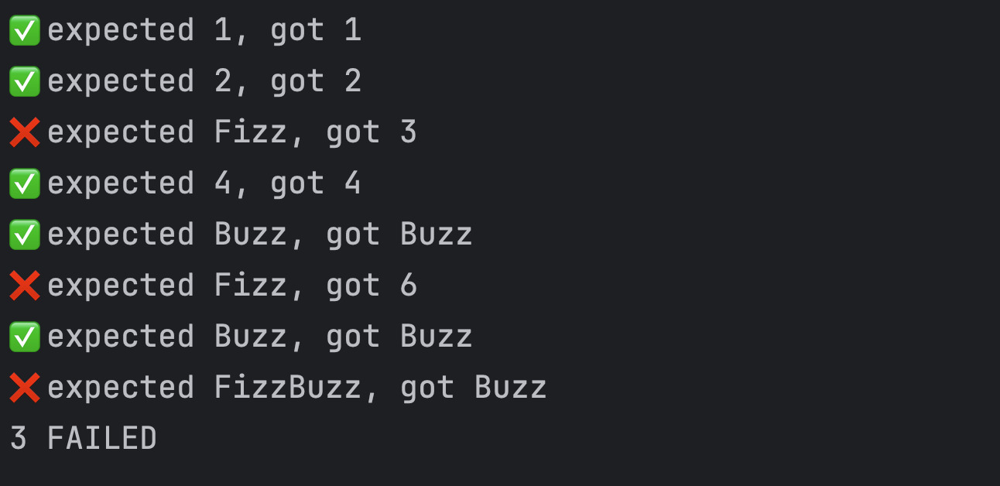

# TDD from First Principles

We'll be solving FizzBuzz together, but we'll do it without any test tooling --
we'll build our own as we go. The first test we write will use no special
tooling. By the end, we will have written about 100 lines of hand-written
test tooling code in JavaScript which we use to write Jest/Jasmine style
`describe`/`it`/`expect` tests.

For those who test or want to, this is a discussion of the essence of unit
testing with advice for improving your testing game.

For those who teach or coach, this is a discussion of how we can use first
principles to de-mystify "magical black box" tools.

## Dev Notes

### Prerequisites

- Node >= 22
- that's it -- there's no npm dependencies here

### Running

Run the solution with:

    node ./main.mjs

Run the unit tests with:

    ./test.mjs

## Screenshots

