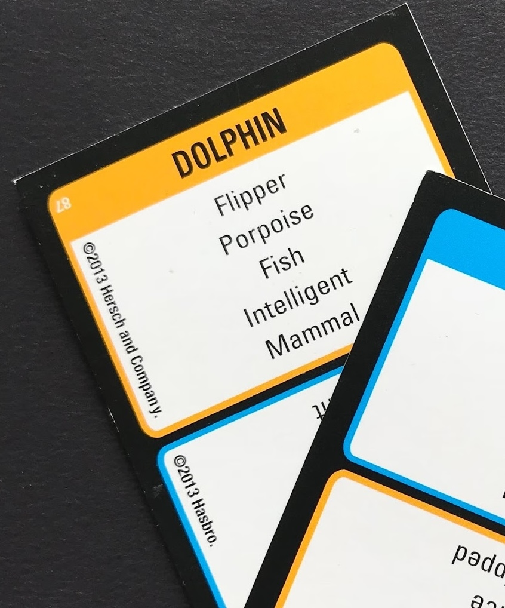
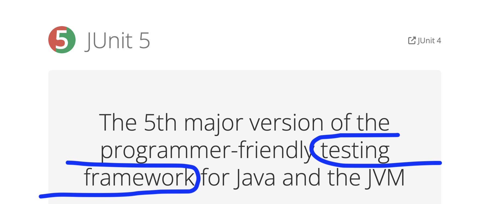
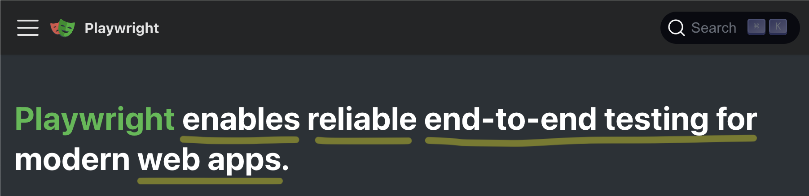
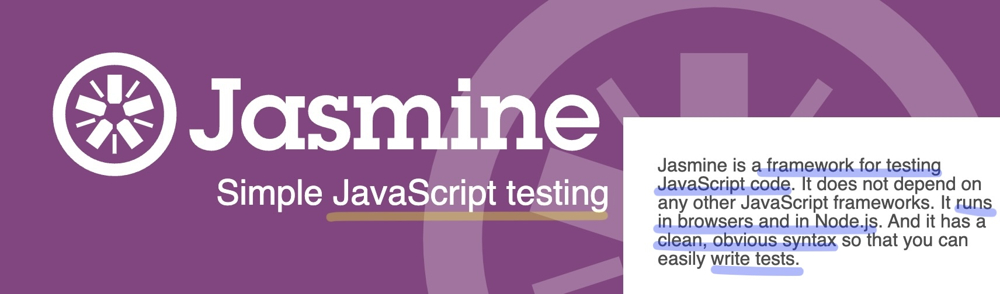

## What Even Is A Test Framework?

Escaping the Jargon Trap


---


# About Me

I **write software** in an ensemble (mob) for Hunter Industries.

My job is primarily **coaching**, but I do it by **coding with others**.

alex&ZeroWidthSpace;**@alexanderbird**.software  
**@alexanderbird**@mstdn.ca

---


# About Me

I'm learning about how to **transmit mental models** to others.

My current focus is on how to efficiently **make others more effective**.

So I end up thinking a lot about how we learn and teach.

---

# Taboo

Give clues to get your team to say **"Dolphin"**, but you can't say any of these words.



---

## The "Taboo Test"

You can pass the "Taboo Test" if you can **explain a concept** without **jargon**.


---

## The "Jargon Trap"

For our day-to-day work, **jargon speeds communication**.

But **if we cannot explain ourselves without jargon**, we **don't understand** what we're
talking about.


---

# Learning Algorithm

#### What if we didn't have X?

I'm going to share a **learning strategy** that I have found helpful for myself and others
to **get out of the
Jargon Trap**; to learn enough to **pass the "Taboo Test"**.


---

# Learning Algorithm

#### What if we didn't have X?

We're going to use unit test frameworks as an **example of this learning approach**.


---

# What Even Is a Test Framework?

**Pretend** with me for a moment that you do not know **what is a test framework**.

If you genuinely don't know, even better.

---

# Sidebar: Why Are We Pretending?

- Software dev is a **learning profession**.
- When you're a **faster learner**, you **do better**
- This talk is **an exercise in learning**
- So even if you are a testing expert: pretend with me that you aren't
    - You still have to learn *something* in your career
    - And **this exercise** may **help you become a better learner**
    - (or a **better teacher**)

---

# Pretend We're In The Jargon Trap

- You use a test frameworks, but **it's still magic to you**.
- Someone else set it up
    - (so if the tests can't run at all, you'll need help)
- When you write tests, you
    1. Find another test in the codebase
    2. **Copy + paste** it
    3. Modify it

---

# Escaping the Jargon Trap

You start by doing a web search: let's learn more about test frameworks

---


---



---



---



---

# Wikipedia

#### Test Automation Framework

- "Is an **integrated system**"
- "Sets the **rules of automation** of a specified product"
- "**Integrates** the function libraries, test data sources, object details, and various
  reusable models"
- "The framework **provides the basis of test automation** and **simplifies the automation
  effort**"

---

# The "Taboo Test"

Define "Testing Framework" without saying these words

| Testing Framework |
|-------------------|
| Tool              |
| Technology        |
| Unit              |
| Test              |
| Automation        |

---

# The "Taboo Test"

Take 1 minute; Write down your definition (you'll need it at the end)

| Testing Framework |
|-------------------|
| Tool              |
| Technology        |
| Unit              |
| Test              |
| Automation        |

---

# Time's Up

Let's answer this question together!


---

# Learning Prompt

If we didn't have X, what would we do instead?


---

# Learning Prompt

If we didn't have **our test framework**, what would we do instead?

Once we answer this, we'll be **able to pass the "Taboo Test"**.


---

# Exercise

Discover the essence of a **test framework** by building one from scratch.


---

# Exercise

We're going to be coding **FizzBuzz** together, and we'll be **creating a test framework**
as we go.

We'll practice Test Driven Development using our homemade test framework.

---

# Aside: FizzBuzz

FizzBuzz is a popular coding exercise.

You print out a sequence of numbers, but for some numbers you print out something else.

```
1
2
Fizz
4
...
```

---

# Exercise

We're going to pay attention to **what we want** and **need** from this framework.

At first, the framework will suck, and **we'll write down why it sucks**.

Then we'll unsuck it.

---

# Exercise

By the end, we'll have **solved FizzBuzz** and we'll have about **~100 lines of code** for
**our test framework**.

---

# Exercise

We'll use **Node.js** with **no dependencies** and aim for Jest/Jasmine style syntax:

```typescript
describe('FizzBuzz', () => {
  it('logs the fizz buzz string up to 4', () => {
    // ...
    expect(consoleLog).toEqual([
      // ...
    ]);
  });
});
```

---

# Exercise

Let's go!!


---

#### What Did We Just Learn?

- About testing?
- About learning?
- About teaching?


---

# A Test Is...

- An **example** of how some **code should behave**.
- It's usually written with a **traditional syntax**.
- You can **run a test**
    - It tells you if the **actual behavior** is **what you expect**.

---

# A Test Framework Is...

A **code library** which...

- Makes it easy to **write** a set of examples
    - for how the code should behave
- Can be run to **check** that all the code behaves as expected
- Outputs a **summary** of the results of all the checks

---

# A Test Framework Is...

- a **syntax** for your **examples**
- an **executable** to **check** your code
    - which **reports** the results concisely

---

#### What Did We Just Learn?

- *Testing*: Tests are executable examples
- About learning?
- About teaching?


---

# The "Taboo Test"

1. Take a **tool, practice, or concept** you use at work.
2. Explain it **in your own words**, like you would to a friend from outside the software
   industry.
    - What is it for?
    - How does it work?
3. If you have a hard time explaining it, **you just found a learning opportunity** 🥳

---

# Learning Opportunity

When I can't explain something I use often, **I make it my aim to become an expert in my
area of confusion**.

I do whatever it takes to become an expert.

---

# Become An Expert

- Deep dive on **YouTube** (from one related video to the next)
- **Build it** yourself **from scratch** (like we did together)
    - Or brainstorm how you would build it from scratch
- Buy a **textbook**, and read the whole thing
- Write a blog post or make a video **explain**ing the thing
    - (and do the **research** you need to do to prepare the answer)
- **Find another expert** and ask them to teach you

---

# No, Seriously,

**you can become an expert!**

You don't have to "fake it until you make it".

If you **need to know** something for work,  
it's faster to **stop and learn it** than to fake it.


---

#### What Did We Just Learn?

- *Testing*: Tests are executable examples
- *Learning*: If you can't say it without jargon, maybe stop to make yourself
  an expert.
- About teaching?


---

#### Teaching From Miniatures

- Software is complicated
    - But often has a simple core
- The simple core helps understand the mental model
- The mental model helps understand the complicated whole


---

## Examples of Teaching From Miniatures

- `rxjs` is a JavaScript library for asynchronous event pipelines
    - &rarr; building a toy version with the JavaScript `Stream` class
- Complicated array/map/reduce scenarios in production code
    - &rarr; little array/map/reduce
      exercises in an empty codebase

---

#### What Did We Just Learn?

- *Testing*: Tests are executable examples.
- *Learning*: If you can't say it without jargon, maybe stop to make yourself
  an expert.
- *Teaching*: Miniatures help develop mental models.


---

## And What Now?

- *Builders*: Try making **diyUnit** with **your favorite language**.
- *Learners*: This week, pay attention for something you **use but don't understand**.
  Maybe, choose to **become an expert**.
- *Teachers*: If folks are looking for **cheat sheets**, consider instead using a
  miniature to **share your mental model** with them.

---


#### Thanks For Having Me!

Alex Bird

alex&ZeroWidthSpace;**@alexanderbird**.software  
**@alexanderbird**@mstdn.ca

Code and slides:
[github.com/&ZeroWidthSpace;alexbird-hunterindustries/&ZeroWidthSpace;fizz-buzz-diy-test-runner](https://github.com/alexbird-hunterindustries/fizz-buzz-diy-test-runner)
