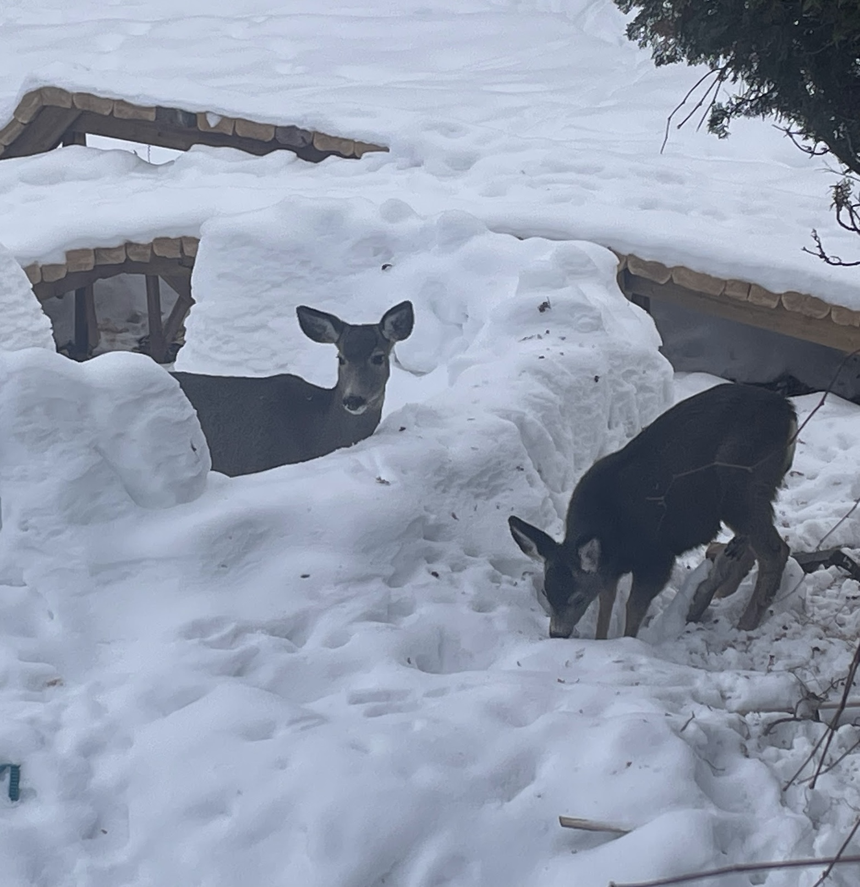

# How Do You Become An Expert

When You're On The Clock

---

### We'll Be Talking About

An alternative to **bluffing** about technology at work.

Strategies to **make yourself an expert** during your workday.

Photos of all the deer around my house.

---

# About Me

**Ensemble (mob) programmer** for Hunter Industries

My job title is "Distinguished Engineer", which at Hunter means
mostly **coaching**, but I do it by **coding with others**.

alex&ZeroWidthSpace;**@alexanderbird**.software  
**@alexanderbird**@mstdn.ca

---

## Learning > Guessing

---

## A guessed solution

**Proposing a solution without understanding the
problem**

- *pro*: if it works, problem solved!
- *con*: if it works, we don't know why it worked
- *con*: if it doesn't work, we're no closer to the solution

---

# Why Do We Guess?

- Often, because of a sense of duty and responsibility
- We want to make good use of our employer's time
- Learning is viewed as a self-indulgent activity
- "I'm here to work"

---

# Two Extremes

- Kevin's surprise
- Rob's textbook

---

## Love the problem

- Instead of guessing solutions, study the problem
- The more you learn about the problem, the more obvious the solution

---

### Compounding learning

- Often, we see **similar problems** in the future
- If we **guess now**, we'll still have to **guess later**
- If we **learn now**, we'll still **know later**

---

<!-- progress slide -->

## How Do You Become An Expert

#### When You're On The Clock

- Instead of guessing, **learn**
- _
    - _
    - _
    - _
- _

---

### The risk of cheat sheets

- map vs turning directions

---

### Learn Mental Models

- story of the engineer with the hammer

---

### Learn Mental Models

Here are some techniques for learning mental models

---

<!-- progress slide -->

## How Do You Become An Expert

#### When You're On The Clock

- Instead of guessing, **learn**
- Focus on learning **mental models**
    - _
    - _
    - _
- _

---

# Read and Forget Most Of It

#### To Learn Mental Models

---

# Read

- Choose **high quality docs**
    - (published API docs, textbook)
- Skim read
    - all of it
    - or at least table of contents

---

## Forget Most Of It

- No need to remember it
- As you work, problems will remind you of something you read
- Then you can look up the details as needed

---

## Goal: Mental Model

The goal is to get a **rough mental model**

- the map of the territory
- a sense of what is possible
- just enough to know what you don't know

---

<!-- backgroundColor: #1B1B1B -->
<!-- backgroundImage: none -->

---

<!-- backgroundImage: url('https://marp.app/assets/hero-background.svg') -->
<!-- progress slide -->

## How Do You Become An Expert

#### When You're On The Clock

- Instead of guessing, **learn**
- Focus on learning **mental models**
    - Skim **Read**
    - _
    - _
- _

---

# Ask Someone For Their Mental Model

#### To Learn Mental Models

---

## Example: "how does Terraform work?"

- We use Terraform to describe our infrastructure as code
- My teammate hadn't used it much
- He could get by, but it felt like magic to him

---

## Example: "how does Terraform work?"

- We took 30-60 minutes at a whiteboard discussing infrastructure as code
- The prompt: "if we didn't have Terraform, what would we do?"
- Discussion of
    - version controlled bash scripts
    - somewhere to store state like resource ids
    - what happens if two people change infra at the same time

---

## Example: "how does Terraform work?"

- My teammate's mental model before the brainstorm:
    - "We use Terraform for our AWS"
- Mental model after the brainstorm:
    - Terraform is a wrapper over the AWS API
- Impact:
    - Terraform resources map to AWS APIs
    - AWS API docs explain the meaning of Terraform inputs
    - Terraform isn't magic anymore

---

#### Ask Someone For Their Mental Model

> Hey, Peter, we can't wrap our heads around Terraform. What even is it?
>
> Do you have an hour to whiteboard with us?

---

#### Ask Someone For Their Mental Model

> Hey, Sharon, I'm trying to understand what Terraform is for. If we didn't use Terraform,
> what would we do?
>
> Do you have some time to help me out?

---

#### Ask Someone For Their Mental Model

> Hey, Dexter, I've seen you're doing a lot of Terraform work.
> We wrote this Terraform code today, but I don't understand it. Can you help me?

---

## Goal: What's Their Mental Model?

You're trying to figure out how this expert thinks about the problem

**They have a mental map** of the territory, and you're trying to **draw it out of them**

---

#### Prerequisite: Safe To Ask

For this to work, you have to be in an environment where it is **safe to admit you don't
understand**.

If you don't have that at work, consider asking a friend from outside your company

---

<!-- progress slide -->

## How Do You Become An Expert

#### When You're On The Clock

- Instead of guessing, **learn**
- Focus on learning **mental models**
    - Skim **Reading**
    - **Ask** Others
    - _
- _

---

# Play

#### To Learn Mental Models

---

# Play

Sometimes the fastest way to solve a problem is to **goof off**

That means we're busy without producing something useful

The useful part is what we learn

---

# Play at Work

- Code exercises
- Toy projects
- Try lots of different things

---

# The Optics of Play at Work

Won't I get in trouble if I goof off?

---

# How I Think About Play at Work

- If I don't know how to do the thing, I'll have to **make many guesses**
- Use the time I would have been guessing to **learn (play) instead**
- Then **quickly solve the problem** (since I now know how to do it)
-

---

# How I Talk About Play at Work

Short answer: I don't say "play"

It describes the technique, but it's not part of business vocabulary

There are more precise descriptions for what we're doing that are both **true** and *
*professional**

---

### Professional Language for Learning through Play

- "we're building a prototype"
- "we're exploring the capabilities of our dependency so we can integrate with it more
  effectively"
- "we're doing a trial run of the integration in a sandbox so we can more quickly pinpoint
  problems"

---

### Professional Language for Learning through Play

- "we're doing assumption testing on this third party component"
- "the last few times we used X we went 1d over budget. We are spending 4h finding ways to
  reduce the uncertainty around X to reduce the chance of repeating the overage. We'll
  measure our next use of X to see if we still exceed our estimate."

---

<!-- progress slide -->

## How Do You Become An Expert

#### When You're On The Clock

- Instead of guessing, **learn**
- Focus on learning **mental models**
    - Skim **Read**
    - **Ask** Others
    - **Play**
- _

---

# Reporting

Even if learning is more efficient, what do I tell my boss and stakeholders?

They want to see progress; what if they see me studying? Won't it look bad?

---

# Making a Business Justification for Learning

1. Identify the business driver that relates to learning
2. Report your learning in the context of that business driver

---

# Learning to de-risk delivery

If your business **values predictable delivery**, frame learning time as **work done to
reduce variability**.

- point to recent times of unexpected delay because of technical surprises
- invest in learning to reduce those surprise delays

---

# Sometimes, leaders want risk

There are business situations where we need to take risks

Don't assume your leader wants to reduce risk

---

# Learn to invest in future delivery

Sometimes, your business leaders want to invest in the future. "What can we do to deliver
faster?"

You can report learning time as time spent to make us go faster

---

# Learning for short term speed

I've found it's not uncommon that the fastest way to do this week's work is to stop and
learn

If that's the case, report your learning time as the most efficient way to complete your
current task

---

## Figure out how to report learning time well

- If it's good for the business, then your leaders should be happy you're doing it
- But if you can't explain why it's good for business, your leaders are not likely to be
  happy you're doing it
- So figure out how to explain why it's good for the business
- Then everyone's happy

---

<!-- progress slide -->

## How Do You Become An Expert

#### When You're On The Clock

- Instead of guessing, **learn**
- Focus on learning **mental models**
    - Skim **Read**
    - **Ask** Others
    - **Play**
- Figure out how to report learning time well

---

## A Live Example

Learning Mental Models Through Play

---

#### A contrived example

I'm pretending I'm not really familiar with unit testing

This is a dramatic reenactment of real learning through play that I've done over the years

It's fake, but it's describing something that's real

---

# Let's Get Coding!

---

### Reflect on the exercise

We turn the play into learning by reflecting

---

## Adjusting our Mental Model

- "Just" is a tool for summary
    - "Just" invites us to overlook details
    - Often not what we want
    - But useful for summarizing learning

---

#### Models overlook details

- The map is not the territory
    - but the territory doesn't fit in my pocket
- Every model is wrong, some are useful

 
 
<small><small>(see Map-territory relation as discussed by Alfred
Korzybski)</small></small>

---

##### Using "just" statements to improve your mental model

Just statements are often technically incorrect

But they fit in our brains easily (like a map in a pocket)

We're aiming for **useful** and **less wrong than before**

---

### "unit tests are just..."

- A unit test suite is "just" a collection of examples
- A unit test assertion is "just" a comparison and a print statement
- A unit test runner is "just" a program that tells me if my code matches all my examples

---

## What's the use of those "just" statements?

- It turns out `console.log()` and `expect().toEqual()` can do similar things
    - so `expect().toEqual()` **doesn't feel so magical**
- **New insight** for how to write tests: "I'm writing a collection of examples"
- **New appreciation** for unit test framework: a single "yes" or "no" to tell me if my
  code is OK
    - instead of reading all the `console.log()`s

---

## Recap

- Often **we skip learning** because of our **sense of professionalism**:
    - "I need to stay on task"
- But as a professional, **it's more important to do good work than to look good**
- It's a mark of professionalism to say **"I don't know; I'm going to take some time to
  learn"**
- And as we learn, focus on **learning mental models** rather than rules of thumb

---

# Builders

##### How to put this into practice?

You don't need permission to **take the fastest route**  
often learning is the fastest route.

---

# Builders

##### How to put this into practice?

Take time to form a useful mental model

- skim read the docs
- ask for advice
- play in a sandbox

---

# Those Who Support Builders

##### How to put this into practice?

Builders seem to think they **need permission to stop
the work, even if it's the fastest way to finish** the work

---

# Those Who Support Builders

##### How to put this into practice?

If you don't **expressly state that you support** learning on the job, your **builders may
imagine** that they must not learn at work

- **Coach them** to take the time they need **to become experts**
- When they do take time to learn, **encourage them**
    - which **sets the tone** on the team that learning is a responsible thing to do

---

#### Thanks For Having Me!

Alex Bird

alex&ZeroWidthSpace;**@alexanderbird**.software  
**@alexanderbird**@mstdn.ca

Code and slides:
[github.com/&ZeroWidthSpace;alexbird-hunterindustries/&ZeroWidthSpace;fizz-buzz-diy-test-runner](https://github.com/alexbird-hunterindustries/fizz-buzz-diy-test-runner)
