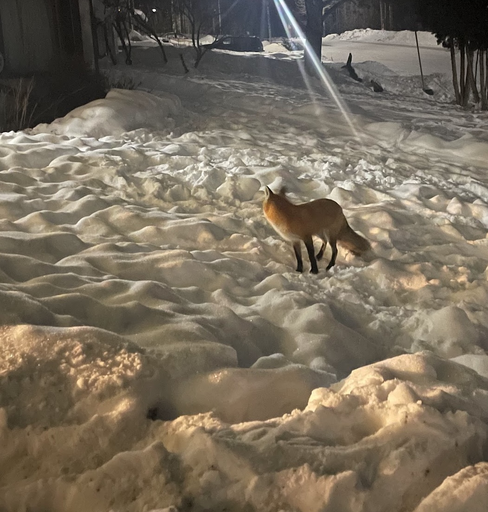

# How Do You Become An Expert

When You're On The Clock

---

### We'll Be Talking About

An alternative to **bluffing** about technology at work.

Strategies to **make yourself an expert** during your workday.

Photos of all the deer around my house.

---

# About Me

**Ensemble (mob) programmer** for Hunter Industries

My job title is "Distinguished Engineer", which at Hunter means
mostly **coaching**, but I do it by **coding with others**.

alex&ZeroWidthSpace;**@alexanderbird**.software  
**@alexanderbird**@mstdn.ca

---

## Learning > Guessing

---

<!-- progress slide -->

## How Do You Become An Expert

#### When You're On The Clock

- Instead of guessing, **learn**
- _
    - _
    - _
    - _

---

### Learn Mental Models

---

<!-- progress slide -->

## How Do You Become An Expert

#### When You're On The Clock

- Instead of guessing, **learn**
- Focus on learning **mental models**
    - _
    - _
    - _

---

# Read and Forget Most Of It

#### To Learn Mental Models

---

<!-- progress slide -->

## How Do You Become An Expert

#### When You're On The Clock

- Instead of guessing, **learn**
- Focus on learning **mental models**
    - Skim **Read**
    - _
    - _

---

# Ask Someone For Their Mental Model

#### To Learn Mental Models

---

<!-- progress slide -->

## How Do You Become An Expert

#### When You're On The Clock

- Instead of guessing, **learn**
- Focus on learning **mental models**
    - Skim **Reading**
    - **Ask** Others
    - _

---

# Play

#### To Learn Mental Models

---

<!-- progress slide -->

## How Do You Become An Expert

#### When You're On The Clock

- Instead of guessing, **learn**
- Focus on learning **mental models**
    - Skim **Read**
    - **Ask** Others
    - **Play**

---

## A Live Example

Learning Mental Models Through Play

---

#### Thanks For Having Me!

Alex Bird

alex&ZeroWidthSpace;**@alexanderbird**.software  
**@alexanderbird**@mstdn.ca

Code and slides:
[github.com/&ZeroWidthSpace;alexbird-hunterindustries/&ZeroWidthSpace;fizz-buzz-diy-test-runner](https://github.com/alexbird-hunterindustries/fizz-buzz-diy-test-runner)
