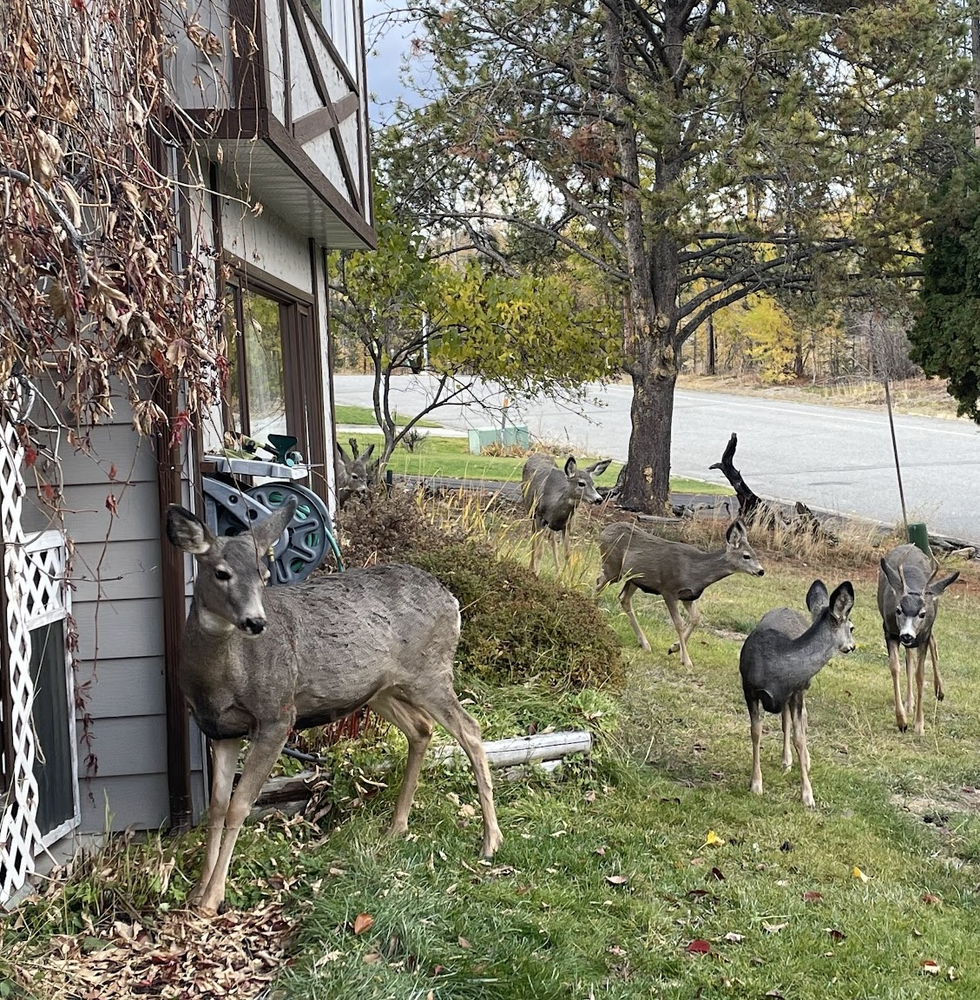

# How Do You Become An Expert

When You're On The Clock


---

### We'll Be Talking About

An alternative to **bluffing** about technology at work.

Strategies to **make yourself an expert** during your workday.

Photos of all the deer around my house.


---


# About Me

**Ensemble (mob) programmer** for Hunter Industries

My job title is "Distinguished Engineer", which at Hunter means
mostly **coaching**, but I do it by **coding with others**.

alex&ZeroWidthSpace;**@alexanderbird**.software  
**@alexanderbird**@mstdn.ca

---

## Question for You

How long to spend on learning

When you need to know something for work,

but you don't know that thing yet?


---

## Yuri's Textbook

An anecdote


---

# How Do You Become An Expert

When You're On The Clock


---

# Answer:

## Stop and Learn

1. Stop working
2. Learn the thing
3. Start working


---

## Example: Unit Test Frameworks

Let's pretend...

- We use a test framework, but **it's still magic to us**.
- Someone else set it up
    - (so if the **tests can't run** at all, **we'll need help**)
- When we write tests, we
    1. Find another test in the codebase
    2. **Copy + paste** it
    3. Modify it

---

## Example: Unit Test Frameworks

We noticed that we do a lot of guessing about this test tooling.

So far, our strategy has been "**fake it 'till you make it**".

We're ready to try something different.

---

## Example: Unit Test Frameworks

We've stopped our work  
with the goal of becoming more of an expert

---

## A Quick Aside

For most of the rest of the talk we'll be exploring this example

If you want to **learn about learning**, I suggest you pay attention to the **high level
technique.**

If you want to **learn about test frameworks**, I suggest you pay attention to the
**technical details.**

---

# Becoming an Expert

We'll start by doing a web search: let's learn more about test frameworks

---


---


---


---


---

# Wikipedia

#### Test Automation Framework

- "Is an **integrated system**"
- "Sets the **rules of automation** of a specified product"
- "**Integrates** the function libraries, test data sources, object details, and various
  reusable models"
- "The framework **provides the basis of test automation** and **simplifies the automation
  effort**"

---

### Becoming An Expert

- ☑️ quick web search
- 🔳 write what I know



---

## Exercise: Define "Test Framework"

I'd like everyone to take **one minute** to write down
a few-sentence definition of a test framework.

Pretend you're **explaining it to a friend** who **does not work in software**.

---

### Becoming An Expert

- ☑️ quick web search
- ☑️ write what I know
- 🔳 toy project


---

# Learning Prompt

If we didn't have X, what would we do instead?


---

# Learning Prompt

If we didn't have **our test framework**, what would we do instead?


---

# Exercise

Discover the essence of a **test framework** by building one from scratch.


---

# Exercise

We're going to be coding **FizzBuzz** together, and we'll be **creating a test framework**
as we go.

We'll practice Test Driven Development using our homemade test framework.

---

# Aside: FizzBuzz

FizzBuzz is a popular coding exercise.

You print out a sequence of numbers, but for some numbers you print out something else.

```
1
2
Fizz
4
...
```

---

# Exercise

We're going to pay attention to **what we want** and **need** from this framework.

At first, the framework will suck, and **we'll write down why it sucks**.

Then we'll unsuck it.

---

# Exercise

By the end, we'll have **solved FizzBuzz** and we'll have about **~100 lines of code** for
**our test framework**.

---

# Exercise

We'll use **Node.js** with **no dependencies** and aim for Jest/Jasmine style syntax:

```typescript
describe('FizzBuzz', () => {
  it('logs the fizz buzz string up to 4', () => {
    // ...
    expect(consoleLog).toEqual([
      // ...
    ]);
  });
});
```

---

# Exercise

Let's go!!


---

### Becoming An Expert

- ☑️ quick web search
- ☑️ write what I know
- ☑️ toy project
- 🔳 put together what we know


---

# A Test Is an Executable Example

- An **example** of how some **code should behave**.
- It's usually written with a **traditional syntax**.
- You can **run a test**
    - It tells you if the **actual behavior** is **what you expect**.

---

# A Test Framework Is...

A **code library** which...

- Makes it easy to **write** a set of examples
    - for how the code should behave
- Can be run to **check** that all the code behaves as expected
- Outputs a **summary** of the results of all the checks

---

# More Ideas For Becoming An Expert

- **Build it** yourself **from scratch** (like we did together)
    - Or brainstorm how you would build it from scratch
- Deep dive on **YouTube** (from one related video to the next)
- Buy a **textbook**, and read the whole thing
- Write a blog post or make a video **explaining** the thing
    - (and do the **research** you need to do to prepare the answer)
- **Find another expert** and ask them to teach you

---

# No, Seriously,

**you can become an expert!**

You don't have to "fake it until you make it".

If you **need to know** something for work,  
it's faster to **stop and learn it** than to fake it.


---

## Example of Toy Learning Projects

#### Sandbox for map/filter/reduce

- complicated production code
    - &rarr; sandbox / playground environment

---

## Example of Toy Learning Projects

#### diy event library to mimic `rxjs`

- `rxjs` async event library
    - &rarr; diy version using JavaScript `Stream`

---

## Example of Toy Learning Projects

#### Whiteboarding: what to do without Terraform?

- Terraform for infrastructure as code (IaC)
    - &rarr; imaginary solution of evolving IaC
      from scratch
        - AWS CLI > version controlled scripts > custom framework > managed state

---

# What Did We Just Learn?


---

### ~~How Do You~~ Become An Expert

When You're On The Clock

&darr;

### You Can Become An Expert

When You're On The Clock


---

# And What Now?

#### For Builders

For urgent matters, the fastest way is often to stop and learn

If time or quality are not of the essence, then guessing works just as well

---

# And What Now?

#### For Leaders

- We can't invent without learning
    - If you weren't inventing, you could buy your software off the shelf
- Your people can become experts if they have time to learn
- Expertise makes us faster and better

---

# And What Now?

#### For Leaders

If the work is **urgent**, I suggest you encourage your team to learn what they need to
learn

- Often, **the fastest way to finish** is to **stop and learn**
- I see many coders **assume it's unprofessional** to stop and learn
    - so **they need you to encourage them** to stop and learn

---

# Final Thoughts

In my experience, most software developers

- could make themselves experts
- but don't do so at work
- because they think they aren't supposed to

---

# On Becoming an Expert at Work

- *For builders*: You don't need permission to **take the fastest route**
    - often learning is the fastest route
- *For leaders*: Builders seem to think they **need permission to stop the work, even if
  it's the fastest way to finish** the work
    - consider **encouraging them** to take the time they need **to become experts**

---


#### Thanks For Having Me!

Alex Bird

alex&ZeroWidthSpace;**@alexanderbird**.software  
**@alexanderbird**@mstdn.ca

Code and slides:
[github.com/&ZeroWidthSpace;alexbird-hunterindustries/&ZeroWidthSpace;fizz-buzz-diy-test-runner](https://github.com/alexbird-hunterindustries/fizz-buzz-diy-test-runner)
