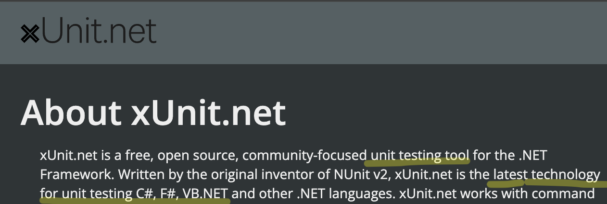
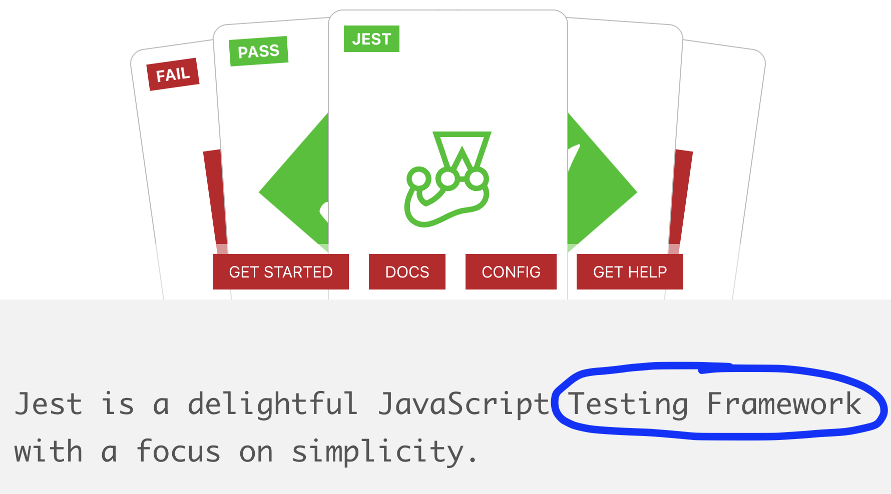
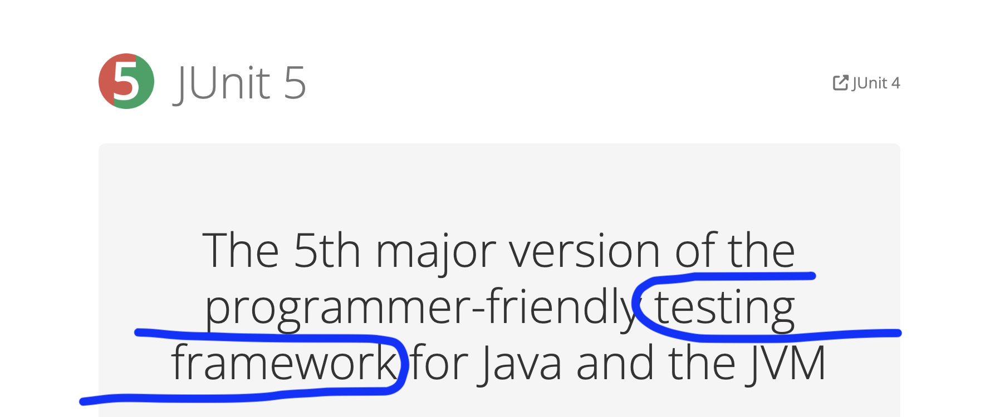
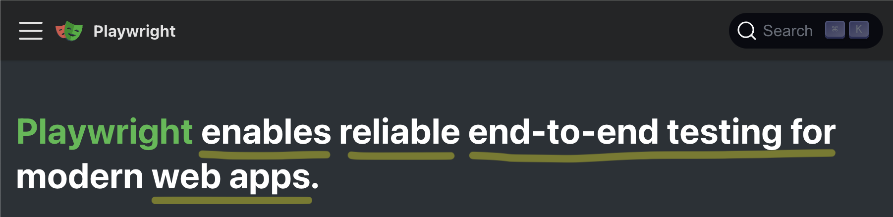

# What Even Is A Test Framework?

The "Taboo Test" Learning Algorithm


---


# About Me

I **write software** in an ensemble for Hunter Industries.

My job is primarily **coaching**, but I do it by **coding with others**.

alex&ZeroWidthSpace;**@alexanderbird**.software  
**@alexanderbird**@mstdn.ca

---

# Taboo

Give clues to get your team to say **"Dolphin"**, but you can't say any of these words.


---

## The "Taboo Test"

You can pass the "Taboo Test" if you can **explain a concept** without **jargon**.


---

## The "Taboo Test"

For our day-to-day work, jargon speeds communication.

But we cannot explain ourselves without jargon, we don't understand what we're talking about.


---

# What Even Is a Test Framework?

**Pretend** with me for a moment that you do not know **what is a test framework**.

If you genuinely don't know, even better.

---

# Sidebar: Why Are We Pretending?

- Software dev is a **learning profession**.
- When you're a **faster learner**, you're **more senior**
- This talk is **an exercise in learning**
- So even if you are a testing expert: pretend with me that you don't have a intuitive understanding of what is a test
  framework
    - Because I'm sure you still have to learn *something* in your career
    - And **this exercise may help you become a better learner**

---

# What Even Is a Test Framework?

**Pretend** with me for a moment that you do not know **what is a test framework**.

You used test frameworks, but they're still magic to you.

---

# Survey the field

You've just joined a team, and on your first day your onboarding buddy says

> We use xUnit for unit testing

So you do a web search

---



---

Let's check some other testing tools

---



---



---



---


---

# Wikipedia

## Test Automation Framework

- "Is an **integrated system**"
- "Sets the **rules of automation** of a specified product"
- "**Integrates** the function libraries, test data sources, object details, and various reusable models"
- "The framework **provides the basis of test automation** and **simplifies the automation effort**"

---

# The "Taboo Test"

Define "Testing Framework" without saying these words

| Testing Framework |
|-------------------|
| Tool              |
| Technology        |
| Unit              |
| Test              |
| Automation        |

---

# The "Taboo Test"

Take 1 minute; Write down your definition (you'll need it at the end)

| Testing Framework |
|-------------------|
| Tool              |
| Technology        |
| Unit              |
| Test              |
| Automation        |

---

# Time's Up

Let's answer this question together


---

# Learning Prompt

If we didn't have X, what would we do instead?

---

# Learning Prompt

If we didn't have **our test framework**, what would we do instead?

Once we answer this, we'll pass the "Taboo Test".

---

# Exercise

Discover the essence of a **test framework** by building one from scratch.

---

# Exercise

We're going to be coding **FizzBuzz** together, and we'll be **creating a test framework** as we go.

We'll practice Test Driven Development using our homemade test framework.

---

# Exercise

We're going to pay attention to **what we want** and **need** from this framework.

At first, the framework will suck, and **we'll write down why it sucks**.

Then we'll unsuck it.

---

# Exercise

By the end, we'll have **solved FizzBuzz** and we'll have about **~100 lines of code** for **our test framework**.

---

# Exercise

We'll use **Node.js** with no **dependencies** and aim for Jest/Jasmine style syntax

```typescript
describe('FizzBuzz', () => {
  it('logs the fizz buzz string up to 4', () => {
    // ...
    expect(consoleLog).toEqual([
      // ...
    ]);
  });
});
```

---

# Exercise

Let's go!!


